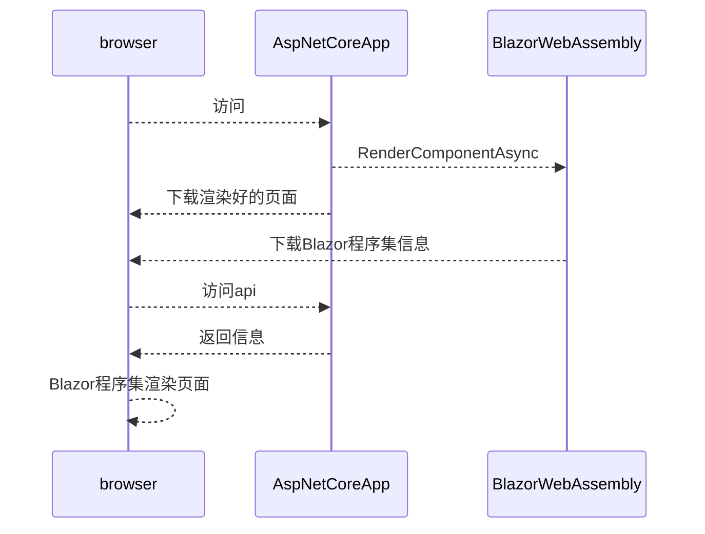

## 简介

这是基于微软发布最新的Blazor WebAssembly预览版`3.2.0-preview1.20073.1`。由于官方模板没有关于这个版本的预渲染模板。本着没有理由不折腾的态度，照着旧版本的代码改成了最新预览版的代码。顺便加深一下理解。官方模板地址:[BlazorWebAssemblyWithPrerendering](https://github.com/danroth27/BlazorWebAssemblyWithPrerendering)

Blazor WebAssembly支持部署在静态站点服务器上也支持托管在AspNetCore App上。要使用预渲染就必须托管在AspNetCore App上。这意味着实现预渲染的Blazor WebAssembly将不能部署在静态站点上。

## 预渲染的实现方式概括

预渲染的实现主要依靠`Html.RenderComponentAsync(...)`。大致流程是这样:



## 实现

实现Blazor你需要建立两个库：

- AspNetCore WebApp(mvc)
- Blazor WebAssembly

对于webapp既可以用mvc的模板也可以用webapi的模板。反正都是要改的，关键就那么几处地方。对于Blazor WebAssembly完全可以不更改，和原来开发客户端程序一样。现在来说说webapp上要做的更改。这里是在webapi模板上做的修改。

使用`dotnet new webapi -o BlazorServer`建立webapi app。完成后需要一下几步：

1. Nuget添加`Microsoft.AspNetCore.Blazor.Server`包，当然版本也是`3.2.0-preview1.20073.1`。
2. 建立`_Host.cshtml`页(相当于静态站点的Index页)，这里将使用`Html.RenderComponentAsync(...)`完成预渲染。
3. 修改`Startup.cs`
4. 修改`launchSettings.json`。

第一步添加`Microsoft.AspNetCore.Blazor.Server`包就不说了。讲下面的

### 建立`_Host.cshtml`

在Pages文件夹下建立`_Host.cshtml`。页面的内容可以从Blazor WebAssembly的`wwwroot`文件夹的`Index.html`拷贝。但是需要修改几个地方。

```cs
//指定路由
@page "/"
@namespace BlazorClient.Pages
@addTagHelper *, Microsoft.AspNetCore.Mvc.TagHelpers

<!DOCTYPE html>
<html>

<head>
    <meta charset="utf-8" />
    <meta name="viewport" content="width=device-width" />
    <title>DailyWord</title>
    <base href="~/" />//添加Blazor WebAssembly中不支持的“~”
    <link href="css/bootstrap/bootstrap.min.css" rel="stylesheet" />
    <link href="css/site.css" rel="stylesheet" />
</head>

<body>
//使用Html.RenderComponentAsync<App>(RenderMode.Static)渲染App组件
    <app>@(await Html.RenderComponentAsync<App>(RenderMode.Static))</app>

    <div id="blazor-error-ui">
        An unhandled error has occurred.
        <a href="" class="reload">Reload</a>
        <a class="dismiss">🗙</a>
    </div>
    <script src="_framework/blazor.webassembly.js"></script>
</body>

</html>
```

### 修改`Startup.cs`

因为是用webApi的模板建立的。并不支持页面服务。所以要有几处修改:

```cs
public void ConfigureServices(IServiceCollection services)
{
    services.AddMvc();//AddControllers()；改为AddMvc();
    services.AddResponseCompression(opts => {
    opts.MimeTypes = ResponseCompressionDefaults.MimeTypes.Concat(
        new[] { "application/octet-stream" });
    });//一个压缩服务,不影响
    services.AddSingleton<IWeatherForecastService, WeatherForecastService>();//注册api接口服务
}
```

这里要注意的是：
**如果你在客户端注入了`IWeatherForecastService`接口并使用的话，在服务端必须注册`IWeatherForecastService`。如果你在服务端不注册相同的接口,那当你浏览到调用该服务的页面，并尝试刷新的时候或直接访问有调用该服务的页面，你就会得到一个异常:找不到该服务。因为首次访问的时候服务端会预渲染这个页面，而这时候就找不到服务了，因为你没在服务端注册**

```cs
public void Configure(IApplicationBuilder app, IWebHostEnvironment env)
{
    if (env.IsDevelopment())
    {
        app.UseDeveloperExceptionPage();
        app.UseBlazorDebugging();//++++++++
    }

    app.UseHttpsRedirection();

    app.UseClientSideBlazorFiles<BlazorClient.Program>();//+++++++

    app.UseStaticFiles();

    app.UseRouting();

    app.UseAuthorization();

    app.UseEndpoints(endpoints =>
    {
        endpoints.MapDefaultControllerRoute();//改成默认路由或你想要的
        endpoints.MapFallbackToPage("/_Host");//++++没有匹配到任何路由，就返回_Host页面
    });
}
```

### 修改`launchSettings.json`

由于使用的时webapi模板,收益默认调试是，浏览器打开后会访问`weatherforecast`接口,但是我们希望看的是网页。

```json
{
  "$schema": "http://json.schemastore.org/launchsettings.json",
  "iisSettings": {
    "windowsAuthentication": false,
    "anonymousAuthentication": true,
    "iisExpress": {
      "applicationUrl": "http://localhost:10061",
      "sslPort": 44327
    }
  },
  "profiles": {
    "IIS Express": {
      "commandName": "IISExpress",
      "launchBrowser": true,
      "launchUrl": "weatherforecast",
      "environmentVariables": {
        "ASPNETCORE_ENVIRONMENT": "Development"
      }
    },
    "DailyWordServer": {
      "commandName": "Project",
      "launchBrowser": true,
      "launchUrl": "",//去掉“weatherforecast”值
      "applicationUrl": "https://localhost:5001;http://localhost:5000",
      "environmentVariables": {
        "ASPNETCORE_ENVIRONMENT": "Development"
      }
    }
  }
}
```

## 总结

Blazor WebAssembly目前还处于预览阶段。用c#代替js写前端也成为了现实。但是目前来说，还只是适合个人玩玩,即使它发布了正式版。在目前前端js库漫天飞的情况下，完全不用js是不可能的。想通过Blazor进军前端的话还是要了解一下js,至少得会使用那些库嘛。当然Blazor也提供了c#和js的完善的互操作性。能不重复造轮子就不重复造轮子。
