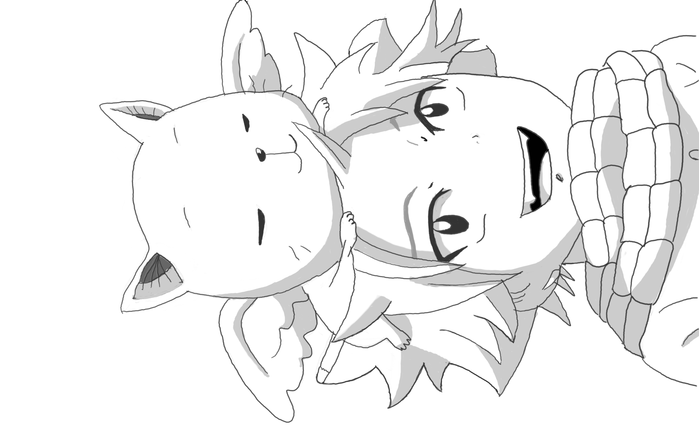

## Welcome

准备开始写博客啦

本blog用的是[Hexo]框架。主题是[Inside]

[Hexo]: https://hexo.io/
[Inside]: https://blog.oniuo.com/

## JustTest

### Heading

``` md
# h1
```

# h1

``` md
## h2
```

## h2

``` md
### h3
```

### h3

``` md
#### h4
```

#### h4

```md
##### h5
```

##### h5

```md
###### h6
```

###### h6

### Head Link

[Heading link](#Heading)

### Image

```md

```


OR

```html

```


### Horizontal Rules

```md
---
```

---

### List

```md
- item
  - item
    - item
- item
```

- item
  - item
    - item
- item

### Order List

```md
1. item
2. item
3. item
```

1. item
2. item
3. item

### Check List

```md
- [ ] uncheck
- [x] check
```

- [ ] uncheck
- [x] check

### Table

```md
| left | center | right |
| ---- | :---: | ---: |
| ***left*** | `center` | right |
| l | c | r |
```

| left | center | right |
| ---- | :---: | ---: |
| ***left*** | `center` | right |
| l | c | r |

### Blockquote

```md
> hexo自带的引用方式 https://hexo.io/docs/tag-plugins#Block-Quote
```

> hexo自带的引用方式 https://hexo.io/docs/tag-plugins#Block-Quote

### Code Block

hexo附加了一些语法 https://hexo.io/docs/tag-plugins#Code-Block

```cs
 static void main(){
     Console.WriteLine("");
 }
```

### Math

```md
$$
f(x)=kx+b
$$
```

$$
f(x)=kx+b
$$
